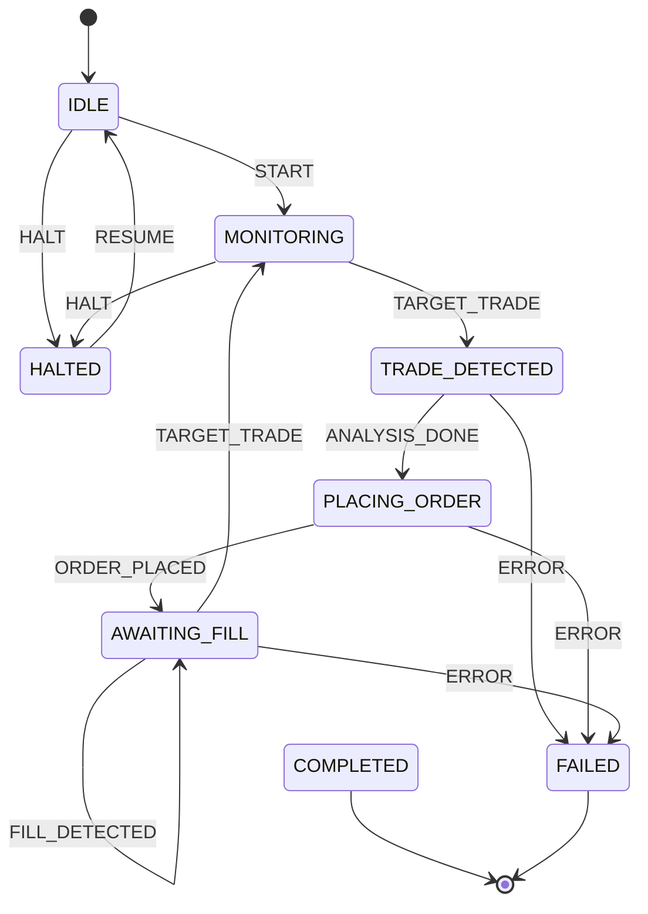

# Copy Trade Workflow -- State Machine Specification

**Status:** Implemented (code-level)
**Source:** `polymind/workflows/copy_trade/state_machine.py`
**Last updated:** 2026-07-05

## Overview

The Copy Trade workflow monitors target wallet addresses for their trades on
Polymarket and replicates them proportionally. When a target trade is detected,
the workflow analyzes it for suitability, places a matching order, and awaits
fill. After fill, it returns to monitoring for the next trade.

## State Machine Diagram

## States

| State | Meaning |
|---|---|
| `IDLE` | Initial state. No workflow activity. |
| `MONITORING` | Watching target wallets for new trades. |
| `TRADE_DETECTED` | A target trade was detected. Awaiting analysis before acting. |
| `PLACING_ORDER` | Order is being submitted to replicate the trade. |
| `AWAITING_FILL` | Replication order is placed. Waiting for fill or next target trade. |
| `COMPLETED` | Terminal success state. (Currently unused in lifecycle -- see note.) |
| `FAILED` | Terminal failure state. An error occurred. |
| `HALTED` | Paused state. Workflow is suspended pending manual intervention. |

**Note:** The `COMPLETED` terminal state is defined in the enum but is not reachable
in the current transition table. The Copy Trade workflow is designed as a continuous
loop: after `AWAITING_FILL`, a `TARGET_TRADE` event returns to `MONITORING` for the
next cycle. Completed trades are tracked in the history log, not via a terminal state.

## Events

| Event | Trigger | Payload / Notes |
|---|---|---|
| `START` | External command | Begins the workflow lifecycle. |
| `TARGET_TRADE` | Wallet monitor | A target wallet executed a trade. Fires from both `MONITORING` and `AWAITING_FILL`. |
| `ANALYSIS_DONE` | Analysis callback | Trade analysis completed. Sizing and risk checks passed. Transitions to `PLACING_ORDER`. |
| `ORDER_PLACED` | Order submission callback | Replication order placed on the CLOB. |
| `FILL_DETECTED` | Fill monitor | Partial fill detected. Self-loop in AWAITING_FILL. |
| `ERROR` | Exception handler | Any unrecoverable error during processing. |
| `HALT` | External command / safety trigger | Suspends the workflow. |
| `RESUME` | External command | Resumes a halted workflow back to IDLE. |

## Transition Table

| Current State | Event | Next State |
|---|---|---|
| `IDLE` | `START` | `MONITORING` |
| `IDLE` | `HALT` | `HALTED` |
| `MONITORING` | `TARGET_TRADE` | `TRADE_DETECTED` |
| `MONITORING` | `HALT` | `HALTED` |
| `TRADE_DETECTED` | `ANALYSIS_DONE` | `PLACING_ORDER` |
| `TRADE_DETECTED` | `ERROR` | `FAILED` |
| `PLACING_ORDER` | `ORDER_PLACED` | `AWAITING_FILL` |
| `PLACING_ORDER` | `ERROR` | `FAILED` |
| `AWAITING_FILL` | `FILL_DETECTED` | `AWAITING_FILL` (self-loop) |
| `AWAITING_FILL` | `TARGET_TRADE` | `MONITORING` (next cycle) |
| `AWAITING_FILL` | `ERROR` | `FAILED` |
| `HALTED` | `RESUME` | `IDLE` |

## Error Handling

- **Invalid transitions:** Firing an event in a state without a defined target raises
  `ValueError`. The `can_transition()` guard should be checked before dispatching.
  Notably, there is no `HALT` from `TRADE_DETECTED` or `PLACING_ORDER` -- callers in those
  states should use `ERROR` instead to abort.
- **ERROR event:** Defined on `TRADE_DETECTED`, `PLACING_ORDER`, and `AWAITING_FILL`. Each
  leads to `FAILED`. In `IDLE`, `MONITORING`, and `HALTED`, callers should use `HALT`.
- **HALT event:** Available from `IDLE` and `MONITORING`. Not defined
  on `TRADE_DETECTED` or `PLACING_ORDER` -- these are brief states where an error should
  route to `FAILED`.
- **Timeouts:** Not enforced at the state machine level. The caller should emit `ERROR`
  or `HALT` if analysis stalls, fills stall, or no target trades are detected for an
  extended period.

## Recovery Paths

| Situation | Recovery |
|---|---|
| `HALTED` after `HALT` | Investigate, fix underlying issue, send `RESUME` to return to `IDLE` and restart. |
| `FAILED` (terminal) | No automated recovery. Create a new workflow instance. History log provides the trace. |
| Stuck in `MONITORING` | No target trades detected. Expected idle behavior; the workflow may monitor indefinitely. External timeout can emit `HALT`. |
| Stuck in `PLACING_ORDER` | Trade analysis stalled. External watchdog should emit `ERROR`. |
| Stuck in `AWAITING_FILL` | Partial fills tracked via self-loop. If fill stalls indefinitely, an external timeout should emit `ERROR` or `HALT`. |
| Continuous cycle | The `TARGET_TRADE` event from `AWAITING_FILL` back to `MONITORING` enables a continuous monitoring loop. Each cycle is recorded in the history log for auditing. |

## Simulation / Paper Mode

The `CopyTradeStateMachine` is mode-agnostic. In simulation/paper mode:

- **Target trade detection** is driven by a simulated wallet monitor that replays
  historical trades or generates synthetic trade events.
- **Trade analysis** runs the same logic with simulated market data for sizing and
  risk checks.
- **Fill detection** uses the `FillModel` to simulate fills at CLOB bid/ask prices.
- **History tracking** works identically to live mode, enabling replay and debugging
  from the same log format.
