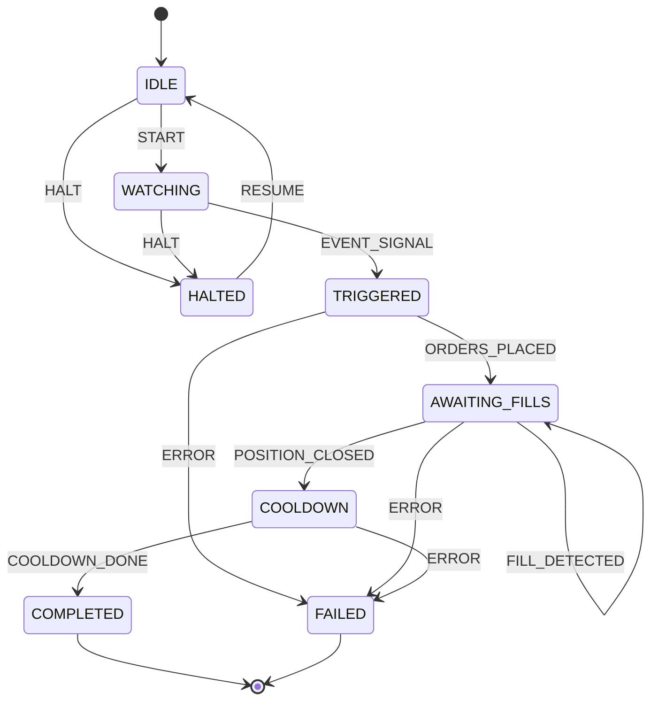

# Event MM Workflow -- State Machine Specification

**Status:** Implemented (code-level)
**Source:** `polymind/workflows/event_mm/state_machine.py`
**Last updated:** 2026-07-05

## Overview

Event-driven market making reacts to external events (news, announcements, price
movements). The state machine tracks the lifecycle from idle watching through cooldown
after an event trigger -- placing orders when a signal fires, awaiting fills, then
cooling down before the next cycle.

## State Machine Diagram

## States

| State | Meaning |
|---|---|
| `IDLE` | Initial state. No workflow activity. |
| `WATCHING` | Monitoring markets for event signals (news, price movements, announcements). |
| `TRIGGERED` | An event signal was detected. Orders are being prepared for placement. |
| `AWAITING_FILLS` | Orders have been placed. Waiting for fills or position close. |
| `COOLDOWN` | Position was closed. Waiting for cooldown period before next cycle. |
| `COMPLETED` | Terminal success state. Cooldown finished. |
| `FAILED` | Terminal failure state. An error occurred. |
| `HALTED` | Paused state. Workflow is suspended pending manual intervention. |

**Note:** The `PLACING_ORDERS` enum value is defined in the source code but is not
reachable in the current transition table. The `TRIGGERED` state serves the role of
order preparation, transitioning directly to `AWAITING_FILLS` once orders are placed.

## Events

| Event | Trigger | Payload / Notes |
|---|---|---|
| `START` | External command | Begins the workflow lifecycle. |
| `EVENT_SIGNAL` | Event monitor | An external event of interest was detected. |
| `ORDERS_PLACED` | Order submission callback | Confirms orders were placed on the CLOB. |
| `FILL_DETECTED` | Fill monitor | Partial fill detected. Self-loop in AWAITING_FILLS. |
| `POSITION_CLOSED` | Position monitor | All positions for this event are closed. |
| `COOLDOWN_DONE` | Timer / scheduler | Cooldown period has elapsed. |
| `ERROR` | Exception handler | Any unrecoverable error during processing. |
| `HALT` | External command / safety trigger | Suspends the workflow. |
| `RESUME` | External command | Resumes a halted workflow back to IDLE. |

## Transition Table

| Current State | Event | Next State |
|---|---|---|
| `IDLE` | `START` | `WATCHING` |
| `IDLE` | `HALT` | `HALTED` |
| `WATCHING` | `EVENT_SIGNAL` | `TRIGGERED` |
| `WATCHING` | `HALT` | `HALTED` |
| `TRIGGERED` | `ORDERS_PLACED` | `AWAITING_FILLS` |
| `TRIGGERED` | `ERROR` | `FAILED` |
| `AWAITING_FILLS` | `FILL_DETECTED` | `AWAITING_FILLS` (self-loop) |
| `AWAITING_FILLS` | `POSITION_CLOSED` | `COOLDOWN` |
| `AWAITING_FILLS` | `ERROR` | `FAILED` |
| `COOLDOWN` | `COOLDOWN_DONE` | `COMPLETED` |
| `COOLDOWN` | `ERROR` | `FAILED` |
| `HALTED` | `RESUME` | `IDLE` |

## Error Handling

- **Invalid transitions:** Firing an event in a state where it has no defined target
  raises `ValueError`. For example, `EVENT_SIGNAL` from `TRIGGERED` or `START` from
  `WATCHING` will both fail. Callers should guard against these with `can_transition()`.
- **ERROR event:** Defined on `TRIGGERED`, `AWAITING_FILLS`, and `COOLDOWN`. Each leads
  to `FAILED`. In states without an `ERROR` entry (`IDLE`, `WATCHING`, `HALTED`),
  callers should use `HALT` instead.
- **HALT event:** Available from `IDLE` and `WATCHING`. Not available
  from `TRIGGERED` or `COOLDOWN` -- if a halt is needed during those states, the caller
  should first transition to a halt-adjacent state or handle it externally.
- **Timeouts:** Not enforced at the state machine level. The caller should emit `ERROR`
  or `HALT` if `WATCHING` waits too long for a signal, or if `AWAITING_FILLS` /
  `COOLDOWN` exceed configured durations.

## Recovery Paths

| Situation | Recovery |
|---|---|
| `HALTED` after `HALT` | Investigate, fix, send `RESUME` to return to `IDLE` and restart. |
| `FAILED` (terminal) | No automated recovery. Create a new workflow instance. Review history log for cause. |
| Stuck in `WATCHING` | No event signal received. External timeout should emit `HALT` to allow manual review, or let the workflow continue watching indefinitely (expected idle behavior). |
| Stuck in `AWAITING_FILLS` | Partial fills detected via self-loop. Use `HALT` to suspend if fills stall indefinitely. |
| Stuck in `COOLDOWN` | External timer should fire `COOLDOWN_DONE`. If the timer fails, an external watchdog should emit `ERROR`. |

## Simulation / Paper Mode

The `EventMMStateMachine` is mode-agnostic. In simulation/paper mode:

- **Event signals** are generated by the paper event simulator rather than a real market
  data feed.
- **Fill detection** uses the `FillModel` to simulate fills from CLOB bid/ask prices.
- **Position close** is determined by the paper position tracker, emitting
  `POSITION_CLOSED` when simulated positions are closed.
- **Cooldown timer** runs in wall-clock time (or optionally simulated at accelerated
  speed in backtesting contexts).
- **History and state transitions** are identical to live mode, enabling replay and
  debugging from the same log format.
