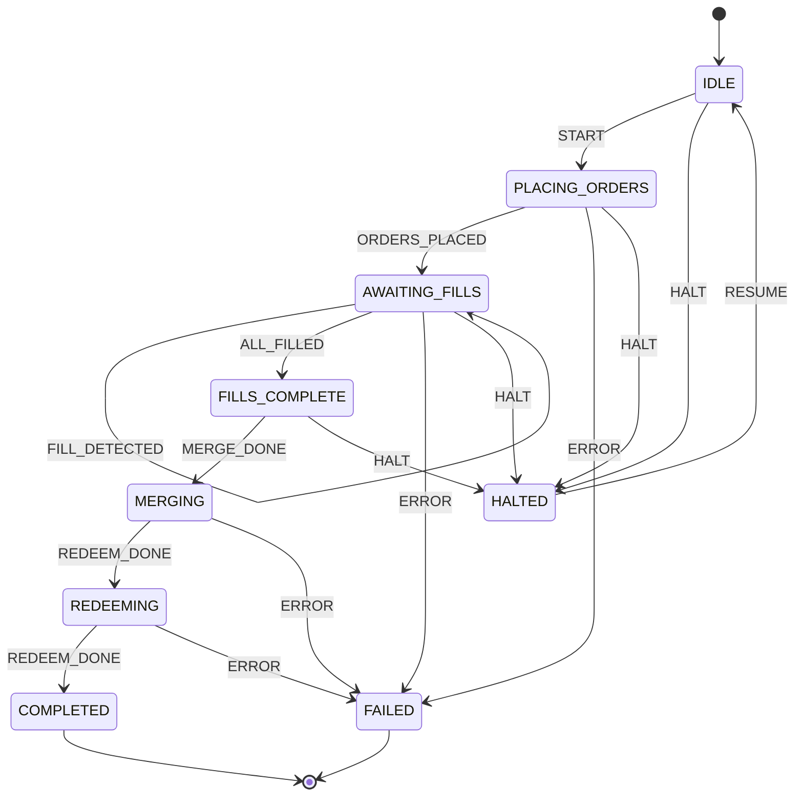

# Maker Rebate Workflow -- State Machine Specification

**Status:** Implemented (code-level)
**Source:** `polymind/workflows/maker_rebate/state_machine.py`
**Last updated:** 2026-07-05

## Overview

The Maker Rebate workflow fills YES and NO orders on a prediction-market outcome pair,
then merges and redeems the paired positions for profit. The state machine tracks the
lifecycle from order placement through settlement.

## State Machine Diagram

## States

| State | Meaning |
|---|---|
| `IDLE` | Initial state. No workflow activity. |
| `PLACING_ORDERS` | Orders are being submitted to the exchange. |
| `AWAITING_FILLS` | Waiting for placed orders to be filled partially or fully. |
| `FILLS_COMPLETE` | All orders have been filled. Ready to merge positions. |
| `MERGING` | Merging YES/NO token positions into the underlying outcome. |
| `REDEEMING` | Redeeming merged positions for payout. |
| `COMPLETED` | Terminal success state. Workflow has settled. |
| `FAILED` | Terminal failure state. An error occurred. |
| `HALTED` | Paused state. Workflow is suspended pending manual intervention. |

## Events

| Event | Trigger | Payload / Notes |
|---|---|---|
| `START` | External command | Begins the workflow lifecycle. |
| `ORDERS_PLACED` | Order submission callback | Confirms orders were placed on the CLOB. |
| `FILL_DETECTED` | Fill monitor | One or more orders filled (but not all). Self-loop in AWAITING_FILLS. |
| `ALL_FILLED` | Fill monitor | All outstanding orders are filled. |
| `MERGE_DONE` | On-chain callback | YES/NO positions merged into redeemable tokens. |
| `REDEEM_DONE` | On-chain callback | Positions redeemed for payout. Fires twice: once for each pair leg. |
| `ERROR` | Exception handler | Any unrecoverable error during processing. |
| `HALT` | External command / safety trigger | Suspends the workflow. |
| `RESUME` | External command | Resumes a halted workflow back to IDLE. |

## Transition Table

| Current State | Event | Next State |
|---|---|---|
| `IDLE` | `START` | `PLACING_ORDERS` |
| `IDLE` | `HALT` | `HALTED` |
| `PLACING_ORDERS` | `ORDERS_PLACED` | `AWAITING_FILLS` |
| `PLACING_ORDERS` | `ERROR` | `FAILED` |
| `PLACING_ORDERS` | `HALT` | `HALTED` |
| `AWAITING_FILLS` | `FILL_DETECTED` | `AWAITING_FILLS` (self-loop) |
| `AWAITING_FILLS` | `ALL_FILLED` | `FILLS_COMPLETE` |
| `AWAITING_FILLS` | `ERROR` | `FAILED` |
| `AWAITING_FILLS` | `HALT` | `HALTED` |
| `FILLS_COMPLETE` | `MERGE_DONE` | `MERGING` |
| `FILLS_COMPLETE` | `HALT` | `HALTED` |
| `MERGING` | `REDEEM_DONE` | `REDEEMING` |
| `MERGING` | `ERROR` | `FAILED` |
| `REDEEMING` | `REDEEM_DONE` | `COMPLETED` |
| `REDEEMING` | `ERROR` | `FAILED` |
| `HALTED` | `RESUME` | `IDLE` |

## Error Handling

- **Invalid transitions:** If an event is fired in a state where it is not defined (e.g.
  `ALL_FILLED` from `IDLE`), the state machine raises a `ValueError` with a message
  describing the invalid transition. Callers should catch this and route to `ERROR` or
  `HALT` as appropriate.
- **ERROR event:** Fired by external exception handlers. Any state that defines an
  `ERROR` transition moves to `FAILED`. States without an explicit `ERROR` entry
  (`IDLE`, `FILLS_COMPLETE`, `HALTED`) still raise `ValueError` if `ERROR` is
  attempted; callers must ensure `HALT` is used instead in those states.
- **HALT event:** Available in most active states. Transitions to `HALTED` regardless
  of what went wrong.
- **Timeouts:** Not enforced at the state machine level. Expected timeout logic lives
  in the caller (WorkflowRunner or orchestrator), which should emit `ERROR` or `HALT`
  when a state takes too long.

## Recovery Paths

| Situation | Recovery |
|---|---|
| `HALTED` after `ERROR` | Investigate root cause, fix underlying issue, then send `RESUME` to return to `IDLE` and restart the workflow. |
| `HALTED` after `HALT` | Same as above: `RESUME` returns to `IDLE`. |
| `FAILED` (terminal) | No automated recovery. A new workflow instance must be created. The history log provides a trace for post-mortem. |
| Invalid transition `ValueError` | The caller should treat this as a programming error and halt. The transition guard (`can_transition`) should be checked before dispatching events in production. |
| Stuck in `AWAITING_FILLS` | The `FILL_DETECTED` self-loop allows partial-fill tracking without leaving the state. If fills never complete, an external timeout should emit `HALT` or `ERROR`. |

## Simulation / Paper Mode

The state machine itself is agnostic to live vs. paper execution -- it only tracks
states and transitions. In simulation/paper mode:

- **Fill detection** is driven by a `FillModel` that simulates fills based on CLOB
  bid/ask prices rather than waiting for real fills.
- **On-chain operations** (`MERGE_DONE`, `REDEEM_DONE`) are simulated by the paper
  executor, emitting the corresponding events without actual on-chain transactions.
- **History tracking** works identically in both modes, making replay and debugging
  consistent.

The same `RebateStateMachine` class is used in both live and paper modes; the mode is
determined by the executor/runner layer, not by the state machine itself.
