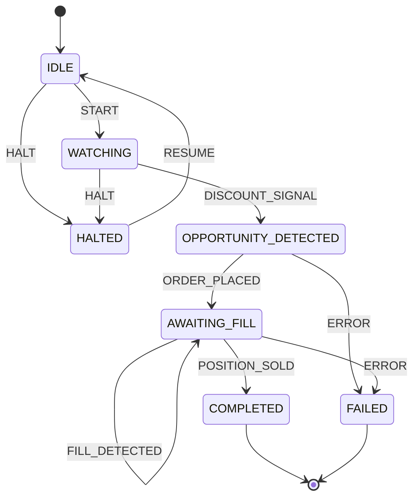

# Sniper Workflow -- State Machine Specification

**Status:** Implemented (code-level)
**Source:** `polymind/workflows/sniper/state_machine.py`
**Last updated:** 2026-07-05

## Overview

The Sniper workflow monitors markets for deep discount opportunities, triggering buy
orders when the price drops far below fair value. Once filled, the position is held
until it can be sold at a profit. The state machine tracks the lifecycle from idle
watching through completion.

## State Machine Diagram

## States

| State | Meaning |
|---|---|
| `IDLE` | Initial state. No workflow activity. |
| `WATCHING` | Monitoring market prices for a discount opportunity against fair value. |
| `OPPORTUNITY_DETECTED` | A price discount was detected. Preparing to place a buy order. |
| `AWAITING_FILL` | Buy order has been placed. Waiting for fill and eventual position sale. |
| `COMPLETED` | Terminal success state. Position was sold. |
| `FAILED` | Terminal failure state. An error occurred. |
| `HALTED` | Paused state. Workflow is suspended pending manual intervention. |

**Note:** The `PLACING_ORDER` enum value is defined in the source code but is not
reachable in the current transition table. The `OPPORTUNITY_DETECTED` state serves the
role of order preparation, transitioning directly to `AWAITING_FILL` once the order is
placed.

## Events

| Event | Trigger | Payload / Notes |
|---|---|---|
| `START` | External command | Begins the workflow lifecycle. |
| `DISCOUNT_SIGNAL` | Price monitor | Market price dropped to a configured discount threshold from fair value. |
| `ORDER_PLACED` | Order submission callback | Confirms the sniper buy order was placed on the CLOB. |
| `FILL_DETECTED` | Fill monitor | Partial fill detected while awaiting fill. Self-loop in AWAITING_FILL. |
| `POSITION_SOLD` | Position monitor | The filled position has been sold (take-profit or stop-loss). |
| `ERROR` | Exception handler | Any unrecoverable error during processing. |
| `HALT` | External command / safety trigger | Suspends the workflow. |
| `RESUME` | External command | Resumes a halted workflow back to IDLE. |

## Transition Table

| Current State | Event | Next State |
|---|---|---|
| `IDLE` | `START` | `WATCHING` |
| `IDLE` | `HALT` | `HALTED` |
| `WATCHING` | `DISCOUNT_SIGNAL` | `OPPORTUNITY_DETECTED` |
| `WATCHING` | `HALT` | `HALTED` |
| `OPPORTUNITY_DETECTED` | `ORDER_PLACED` | `AWAITING_FILL` |
| `OPPORTUNITY_DETECTED` | `ERROR` | `FAILED` |
| `AWAITING_FILL` | `FILL_DETECTED` | `AWAITING_FILL` (self-loop) |
| `AWAITING_FILL` | `POSITION_SOLD` | `COMPLETED` |
| `AWAITING_FILL` | `ERROR` | `FAILED` |
| `HALTED` | `RESUME` | `IDLE` |

## Error Handling

- **Invalid transitions:** Any event fired in a state where it has no transition defined
  raises `ValueError`. For example, `DISCOUNT_SIGNAL` from `OPPORTUNITY_DETECTED` or
  `ORDER_PLACED` from `WATCHING` are both invalid. The `can_transition()` guard should
  be checked before dispatching events.
- **ERROR event:** Defined on `OPPORTUNITY_DETECTED` and `AWAITING_FILL`. Both lead to
  `FAILED`. States without an `ERROR` entry (`IDLE`, `WATCHING`, `HALTED`) require
  `HALT` instead.
- **HALT event:** Available from `IDLE` and `WATCHING`. Not defined
  on `OPPORTUNITY_DETECTED` -- if a halt is needed during order preparation, the caller
  should emit `ERROR` or handle externally.
- **Timeouts:** Not enforced at the state machine level. The caller should emit `ERROR`
  or `HALT` if `WATCHING` takes too long without a signal, or if `AWAITING_FILL` exceeds
  the fill timeout. A position-sell timeout should also be managed externally.

## Recovery Paths

| Situation | Recovery |
|---|---|
| `HALTED` after `HALT` | Investigate, fix underlying issue, send `RESUME` to return to `IDLE` and restart. |
| `FAILED` (terminal) | No automated recovery. Create a new workflow instance. History log provides the trace. |
| Stuck in `WATCHING` | No discount opportunity detected. This is expected behavior; the workflow may watch indefinitely. External timeout can emit `HALT` for manual review if desired. |
| Stuck in `AWAITING_FILL` | Partial fills logged via self-loop. If fill never completes, an external timeout should emit `ERROR` or `HALT`. |
| Stuck in `AWAITING_FILL` after fill | Position was filled but `POSITION_SOLD` never fired. The take-profit/stop-loss monitor may have failed. External watchdog should emit `ERROR`. |

## Simulation / Paper Mode

The `SniperStateMachine` is mode-agnostic. In simulation/paper mode:

- **Discount signals** are generated by the paper price simulator, which may use
  historical or synthetic price data rather than live market feeds.
- **Fill detection** uses the `FillModel` to simulate fills from CLOB bid/ask depth.
- **Position sale** is determined by the paper position tracker applying configured
  take-profit and stop-loss thresholds.
- **History tracking** works identically in both modes, enabling consistent replay
  and debugging across live and simulated runs.
